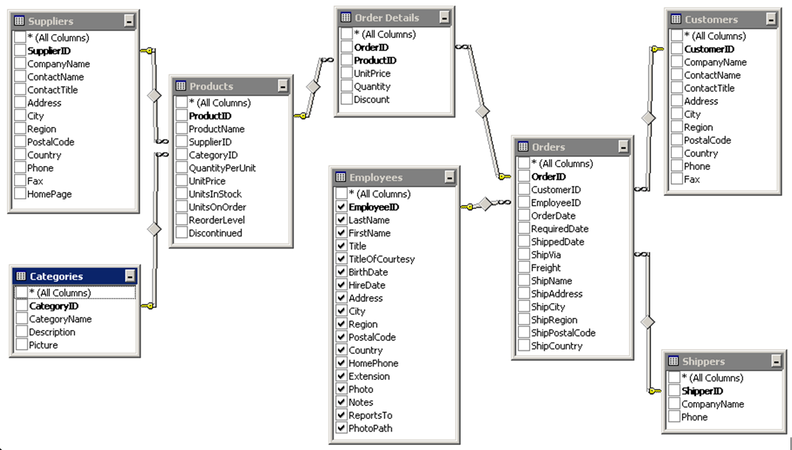

<a id="readme-top"></a>
<br />
<div align="center">
    <h3 align="center">SQL SERVER BASIC</h3>
</div>

<div>
    <a href="#" target="_blank"></a>
</div>

<!-- MAIN CONTENTS -->
<details>
  <summary>Main contents</summary>
  <ol>
    <li>
      <a href="#select">SELECT</a>
      <ul>
        <li><a href="#select-distinct">SELECT DISTINCT</a></li>
        <li><a href="#select-top">SELECT TOP</a></li>
      </ul>   
    </li>
    <li>
      <a href="#alias">Alias</a>
    </li>
    <li><a href="#min-max">Min Max</a></li>
    <li><a href="#count-sum-avg">Count-Sum-AVG</a></li>
    <li><a href="#order-by">ORDER BY</a></li>
    <li><a href="#math-operations">Math Operations</a></li>
    <li><a href="#where">Where</a></li>
    <li><a href="#and-or-not">And-Or-Not</a></li>
    <li><a href="#between">Between</a></li>
    <li><a href="#like">LIKE</a></li>
    <li><a href="#wildcard">Wildcard</a></li>
    <li><a href="#in-not-in">IN-NOT IN</a></li>
    <li><a href="#is-null-is-not-null">IS NULL - IS NOT NULL</a></li>
    <li><a href="#group-by">GROUP BY</a></li>
    <li><a href="#day-month-year">Day-Month-Year</a></li>
    <li><a href="#having">HAVING</a></li>
    <li><a href="#query-data-from-multiple-tables">Query data from multiple tables</a></li>
    <li><a href="#union">Union</a></li>
    <li><a href="#join">JOIN - LEFT JOIN - RIGHT JOIN - FULL JOIN</a></li>
    <li><a href="#sub-query">Sub query</a></li>
    <li><a href="#sql-statement-execution-order">SQL statement execution order</a></li>
    <li><a href="#common-table-expression">Common Table Expression</a></li>
    <li><a href="#recursive-query">Recursive query</a></li>
    <li><a href="#windows-functions">Windows Functions</a></li>
    <li><a href="#create-database">Create Database</a></li>
    <li><a href="#create-table">Create Table</a></li>
    <li><a href="#insert">INSERT</a></li>
    <li><a href="#select-into">SELECT INTO</a></li>
    <li><a href="#delete">DELETE</a></li>
    <li><a href="#update">UPDATE</a></li>
    <li><a href="#create-index">Create Index</a></li>
    <li><a href="#view">View</a></li>
    <li><a href="#stored-procedures">Stored Procedures</a></li>
    <li><a href="#trigger">Trigger</a></li>
  </ol>
</details>


<!-- DATABASE -->
### DATABASE

_Northwind Database_    [>>See more](https://docs.yugabyte.com/preview/sample-data/northwind/)


<ol>
    <li>
      <a id="select">SELECT</a>
<div style="margin-left: 2em;">
      
* Viết câu lệnh SQL lấy ra tên của tất cả các sản phẩm trong bảng Products
```sh
SELECT [ProductName] FROM [dbo].[Products];
```
* Viết câu lệnh SQL lấy ra tên sản phẩm, giá bán trên mỗi đơn vị, số lượng sản phẩm trên đơn vị trong bảng Products
```sh
SELECT [ProductName], [UnitPrice], [QuantityPerUnit]
FROM [dbo].[Products];
```
* Viết câu lệnh SQL lấy ra tên công ty của khách hàng và quốc gia của các khách hàng đó trong bảng Customers
```sh
SELECT [CompanyName], [Country]
FROM [dbo].[Customers];

SELECT CompanyName, Country
FROM dbo.Customers;
```
* Viết câu lệnh SQL lấy ra tất cả dữ liệu từ bảng Products
```sh
SELECT *
FROM [dbo].[Products];
```
* Viết câu lệnh SQL lấy ra tất cả dữ liệu từ bảng Customers
```sh
SELECT *
FROM [dbo].[Customers];
```
</div>
      <ul>
        <li><a id="select-distinct">SELECT DISTINCT</a></li>
<div style="margin-left: 2em;">


* Viết câu lệnh SQL lấy ra tên các quốc gia (Country) khác nhau từ bảng  Customers
```
SELECT DISTINCT [Country] 
FROM [dbo].[Customers];
```
* Viết câu lệnh SQL lấy ra tên các mã số bưu điện (PostalCode) khác nhau từ bảng Nhà cung cấp - Suppliers
```
SELECT DISTINCT PostalCode 
FROM Suppliers;
```
* Viết câu lệnh SQL lấy ra các dữ liệu khác nhau về họ của nhân viên (LastName) và cách gọi danh hiệu lịch sự (TitleOfCourtesy) của nhân viên từ bảng Employees
```
SELECT DISTINCT [LastName], [TitleOfCourtesy]
FROM [dbo].[Employees];

SELECT DISTINCT [TitleOfCourtesy]
FROM [dbo].[Employees];
```
</div>
        <li><a id="select-top">SELECT TOP</a></li>
<div style="margin-left: 2em;">


* Viết câu lệnh SQL lấy ra 05 dòng đầu tiên trong bảng Customers.
```
SELECT TOP 5 *
FROM [dbo].[Customers];
```

* Viết câu lệnh SQL lấy ra 30% nhân viên của công ty hiện tại.
```
SELECT TOP 30 PERCENT *
FROM [dbo].[Employees];
```

* Viết câu lệnh SQL lấy ra các mã khách hàng trong bảng đơn hàng với quy định là mã khách hàng không được trùng lặp, chỉ lấy 5 dòng dữ liệu đầu tiên.
```
SELECT DISTINCT TOP 5 [CustomerID]
FROM [dbo].[Orders];
```
</div>
      </ul>   
    </li>
    <p align="right">[<a href="#readme-top">back to top</a>]</p>
    <li><a id="alias">Alias</a>
<div style="margin-left: 2em;">

* Viết câu lệnh SQL lấy “CompanyName” và đặt tên thay thế là “Công ty”; “PostalCode” và đặt tên thay thế là “Mã bưu điện”
```
SELECT	[CompanyName] AS [Tên công ty],
		[PostalCode] AS "Mã bưu điện",
		[City] "Thành phố"
FROM [dbo].[Customers];
```
* Viết câu lệnh ra “LastName” và đặt tên thay thế là “Họ”; “FirstName” và đặt tên thay thế là “Tên”
```
SELECT [LastName] AS [Họ và chữ lót],  [FirstName] AS [Tên]
FROM [dbo].[Employees];
```
* Viết câu lệnh SQL lấy ra 15 dòng đầu tiên tất cả các cột trong bảng Orders, đặt tên thay thế cho bảng Orders là “o”
```
SELECT TOP 15 [o].*
FROM [dbo].[Orders] AS [o];
```
</div>
    </li>
    <p align="right">[<a href="#readme-top">back to top</a>]</p>
    <li><a id="min-max">Min Max</a>
    </li>
    <p align="right">[<a href="#readme-top">back to top</a>]</p>
    <li><a id="count-sum-avg">Count-Sum-AVG</a>
    </li>
    <p align="right">[<a href="#readme-top">back to top</a>]</p>
    <li><a id="order-by">ORDER BY</a>
    </li>
    <p align="right">[<a href="#readme-top">back to top</a>]</p>
    <li><a id="math-operations">Math Operations</a>
    </li>
    <p align="right">[<a href="#readme-top">back to top</a>]</p>
    <li><a id="where">Where</a></li><p align="right">[<a href="#readme-top">back to top</a>]</p>
    <li><a id="and-or-not">And-Or-Not</a></li><p align="right">[<a href="#readme-top">back to top</a>]</p>
    <li><a id="between">Between</a></li><p align="right">[<a href="#readme-top">back to top</a>]</p>
    <li><a id="like">LIKE</a></li><p align="right">[<a href="#readme-top">back to top</a>]</p>
    <li><a id="wildcard">Wildcard</a></li><p align="right">[<a href="#readme-top">back to top</a>]</p>
    <li><a id="in-not-in">IN-NOT IN</a></li><p align="right">[<a href="#readme-top">back to top</a>]</p>
    <li><a id="is-null-is-not-null">IS NULL - IS NOT NULL</a></li><p align="right">[<a href="#readme-top">back to top</a>]</p>
    <li><a id="group-by">GROUP BY</a></li><p align="right">[<a href="#readme-top">back to top</a>]</p>
    <li><a id="day-month-year">Day-Month-Year</a></li><p align="right">[<a href="#readme-top">back to top</a>]</p>
    <li><a id="having">HAVING</a></li><p align="right">[<a href="#readme-top">back to top</a>]</p>
    <li><a id="query-data-from-multiple-tables">Query data from multiple tables</a>
    </li>
    <p align="right">[<a href="#readme-top">back to top</a>]</p>
    <li><a id="union">Union</a>
    </li>
    <p align="right">[<a href="#readme-top">back to top</a>]</p>
    <li><a id="join">JOIN - LEFT JOIN - RIGHT JOIN - FULL JOIN</a>
    </li>
    <p align="right">[<a href="#readme-top">back to top</a>]</p>
    <li><a id="sub-query">Sub query</a>
    </li>
    <p align="right">[<a href="#readme-top">back to top</a>]</p>
    <li><a id="sql-statement-execution-order">SQL statement execution order</a>
    </li>
    <p align="right">[<a href="#readme-top">back to top</a>]</p>
    <li><a id="common-table-expression">Common Table Expression</a>
    </li>
    <p align="right">[<a href="#readme-top">back to top</a>]</p>
    <li><a id="recursive-query">Recursive query</a>
    </li>
    <p align="right">[<a href="#readme-top">back to top</a>]</p>
    <li><a id="windows-functions">Windows Functions</a>
    </li>
    <p align="right">[<a href="#readme-top">back to top</a>]</p>
    <li><a id="create-database">Create Database</a>
    </li>
    <p align="right">[<a href="#readme-top">back to top</a>]</p>
    <li><a id="create-table">Create Table</a>
    </li>
    <p align="right">[<a href="#readme-top">back to top</a>]</p>
    <li><a id="insert">INSERT</a>
    </li>
    <p align="right">[<a href="#readme-top">back to top</a>]</p>
    <li><a id="select-into">SELECT INTO</a>
    </li>
    <p align="right">[<a href="#readme-top">back to top</a>]</p>
    <li><a id="delete">DELETE</a>
    </li>
    <p align="right">[<a href="#readme-top">back to top</a>]</p>
    <li><a id="update">UPDATE</a>
    </li>
    <p align="right">[<a href="#readme-top">back to top</a>]</p>
    <li><a id="create-index">Create Index</a>
    </li>
    <p align="right">[<a href="#readme-top">back to top</a>]</p>
    <li><a id="view">View</a>
    </li>
    <p align="right">[<a href="#readme-top">back to top</a>]</p>
    <li><a id="stored-procedures">Stored Procedures</a>
    </li>
    <p align="right">[<a href="#readme-top">back to top</a>]</p>
    <li><a id="trigger">Trigger</a>
    </li>
    <p align="right">[<a href="#readme-top">back to top</a>]</p>
</ol> 

