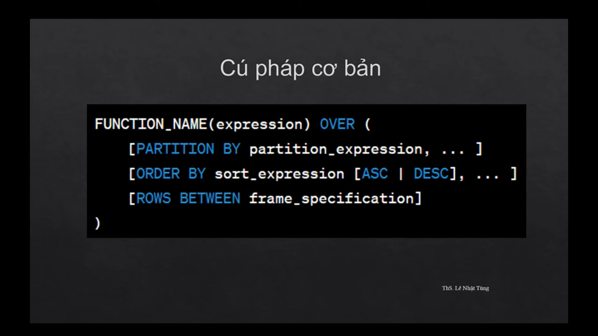

<a id="readme-top"></a>
<br />
<div align="center">
    <h3 align="center">SQL SERVER BASIC</h3>
</div>

<!-- DATABASE -->
### DATABASE

_Northwind Database_    [>>See more](https://docs.yugabyte.com/preview/sample-data/northwind/)


<div>
    <a target="_blank"></a>
</div>

<!-- MAIN CONTENTS -->
<details>
  <summary>Main contents</summary>
  <ol>
    <li>
      <a href="#select">SELECT</a>
      <ul>
        <li><a href="#select-distinct">SELECT DISTINCT</a></li>
        <li><a href="#select-top">SELECT TOP</a></li>
      </ul>   
    </li>
    <li>
      <a href="#alias">Alias</a>
    </li>
    <li><a href="#min-max">Min Max</a></li>
    <li><a href="#count-sum-avg">Count-Sum-AVG</a></li>
    <li><a href="#order-by">ORDER BY</a></li>
    <li><a href="#math-operations">Math Operations</a></li>
    <li><a href="#where">Where</a></li>
    <li><a href="#and-or-not">And-Or-Not</a></li>
    <li><a href="#between">Between</a></li>
    <li><a href="#like">LIKE</a></li>
    <li><a href="#wildcard">Wildcard</a></li>
    <li><a href="#in-not-in">IN-NOT IN</a></li>
    <li><a href="#is-null-is-not-null">IS NULL - IS NOT NULL</a></li>
    <li><a href="#group-by">GROUP BY</a></li>
    <li><a href="#day-month-year">Day-Month-Year</a></li>
    <li><a href="#having">HAVING</a></li>
    <li><a href="#query-data-from-multiple-tables">Query data from multiple tables</a></li>
    <li><a href="#union">Union</a></li>
    <li><a href="#join">JOIN - LEFT JOIN - RIGHT JOIN - FULL JOIN</a></li>
    <li><a href="#sub-query">Sub query</a></li>
    <li><a href="#sql-statement-execution-order">SQL statement execution order</a></li>
    <li><a href="#common-table-expression">Common Table Expression</a></li>
    <li><a href="#recursive-query">Recursive query</a></li>
    <li><a href="#windows-functions">Windows Functions</a></li>
    <li><a href="#sql-command-groups">SQL command groups</a></li>
    <li><a href="#create-database">Create Database</a></li>
    <li><a href="#create-table">Create Table</a></li>
    <li><a href="#insert-into">INSERT INTO</a></li>
    <li><a href="#select-into">SELECT INTO</a></li>
    <li><a href="#delete">DELETE</a></li>
    <li><a href="#update">UPDATE</a></li>
    <li><a href="#create-index">Create Index</a></li>
    <li><a href="#view">View</a></li>
    <li><a href="#stored-procedures">Stored Procedures</a></li>
    <li><a href="#trigger">Trigger</a></li>
  </ol>
</details>


<ol>
    <li>
      <a id="select">SELECT</a>
<div style="margin-left: 2em;">
      
* Viết câu lệnh SQL lấy ra tên của tất cả các sản phẩm trong bảng Products
```sh
SELECT [ProductName] FROM [dbo].[Products];
```
* Viết câu lệnh SQL lấy ra tên sản phẩm, giá bán trên mỗi đơn vị, số lượng sản phẩm trên đơn vị trong bảng Products
```sh
SELECT [ProductName], [UnitPrice], [QuantityPerUnit]
FROM [dbo].[Products];
```
* Viết câu lệnh SQL lấy ra tên công ty của khách hàng và quốc gia của các khách hàng đó trong bảng Customers
```sh
SELECT [CompanyName], [Country]
FROM [dbo].[Customers];

SELECT CompanyName, Country
FROM dbo.Customers;
```
* Viết câu lệnh SQL lấy ra tất cả dữ liệu từ bảng Products
```sh
SELECT *
FROM [dbo].[Products];
```
* Viết câu lệnh SQL lấy ra tất cả dữ liệu từ bảng Customers
```sh
SELECT *
FROM [dbo].[Customers];
```
</div>
      <ul>
        <li><a id="select-distinct">SELECT DISTINCT</a></li>
<div style="margin-left: 2em;">


* Viết câu lệnh SQL lấy ra tên các quốc gia (Country) khác nhau từ bảng  Customers
```sh
SELECT DISTINCT [Country] 
FROM [dbo].[Customers];
```
* Viết câu lệnh SQL lấy ra tên các mã số bưu điện (PostalCode) khác nhau từ bảng Nhà cung cấp - Suppliers
```sh
SELECT DISTINCT PostalCode 
FROM Suppliers;
```
* Viết câu lệnh SQL lấy ra các dữ liệu khác nhau về họ của nhân viên (LastName) và cách gọi danh hiệu lịch sự (TitleOfCourtesy) của nhân viên từ bảng Employees
```sh
SELECT DISTINCT [LastName], [TitleOfCourtesy]
FROM [dbo].[Employees];

SELECT DISTINCT [TitleOfCourtesy]
FROM [dbo].[Employees];
```
</div>
        <li><a id="select-top">SELECT TOP</a></li>
<div style="margin-left: 2em;">


* Viết câu lệnh SQL lấy ra 05 dòng đầu tiên trong bảng Customers.
```sh
SELECT TOP 5 *
FROM [dbo].[Customers];
```

* Viết câu lệnh SQL lấy ra 30% nhân viên của công ty hiện tại.
```sh
SELECT TOP 30 PERCENT *
FROM [dbo].[Employees];
```

* Viết câu lệnh SQL lấy ra các mã khách hàng trong bảng đơn hàng với quy định là mã khách hàng không được trùng lặp, chỉ lấy 5 dòng dữ liệu đầu tiên.
```sh
SELECT DISTINCT TOP 5 [CustomerID]
FROM [dbo].[Orders];
```
</div>
      </ul>   
    </li>
    <p align="right">[<a href="readme-top">back to top</a>]</p>
    <li><a id="alias">Alias</a>
<div style="margin-left: 2em;">

* Viết câu lệnh SQL lấy “CompanyName” và đặt tên thay thế là “Công ty”; “PostalCode” và đặt tên thay thế là “Mã bưu điện”
```sh
SELECT	[CompanyName] AS [Tên công ty],
		[PostalCode] AS "Mã bưu điện",
		[City] "Thành phố"
FROM [dbo].[Customers];
```
* Viết câu lệnh ra “LastName” và đặt tên thay thế là “Họ”; “FirstName” và đặt tên thay thế là “Tên”
```sh
SELECT [LastName] AS [Họ và chữ lót],  [FirstName] AS [Tên]
FROM [dbo].[Employees];
```
* Viết câu lệnh SQL lấy ra 15 dòng đầu tiên tất cả các cột trong bảng Orders, đặt tên thay thế cho bảng Orders là “o”
```sh
SELECT TOP 15 [o].*
FROM [dbo].[Orders] AS [o];
```
</div>
    </li>
    <p align="right">[<a href="readme-top">back to top</a>]</p>
    <li><a id="min-max">Min Max</a>
<div style="margin-left: 2em;">


* Viết câu lệnh SQL tìm giá thấp nhất của các sẩn phẩm trong bảng Products.
```sh
SELECT MIN([UnitPrice]) AS [MinPrice]
FROM [dbo].[Products];
```
* Viết câu lệnh lấy ra ngày đặt hàng gần đây nhất từ bảng Orders.
```sh
SELECT MAX([OrderDate]) AS [MaxOrderDate]
FROM [dbo].[Orders];
```

* Viết câu lệnh SQL tìm số lượng hàng trong kho (UnitsInStock) lớn nhất.
```sh
SELECT MAX([UnitsInStock]) AS [MaxUnitsInStock]
FROM [dbo].[Products];
```
</div>
    </li>
    <p align="right">[<a href="readme-top">back to top</a>]</p>
    <li><a id="count-sum-avg">Count-Sum-AVG</a>
<div style="margin-left: 2em;">

* Hãy đếm số lượng khách hàng có trong bảng (Customers).
```sh
SELECT COUNT(*) AS [NumberOfCustomers]
FROM [dbo].[Customers];

SELECT COUNT([CustomerID]) AS [NumberOfCustomers]
FROM [dbo].[Customers];
```
* Tính tổng số tiền vận chuyển (Freight) của tất cả các đơn đặt hàng.
```sh
SELECT SUM([Freight]) AS [SumFreight]
FROM [dbo].[Orders];
```
* Tính trung bình số lượng đặt hàng (Quantity) của tất cả các sản phẩm trong bảng [Order Details]
```sh
SELECT AVG([Quantity]) AS [AvgQuantity]
FROM [dbo].[Order Details];
```
* Đếm số lượng, tính tổng số lượng hàng trong kho và trung bình giá của các sản phẩm có trong bảng Product.
```sh
SELECT	COUNT(*) AS [NumberOfProducts], 
		SUM([UnitsInStock]) AS [TotalUnitsInStock], 
		AVG([UnitPrice]) AS [AvgUnitPrice]
FROM [dbo].[Products];
```
</div>
    </li>
    <p align="right">[<a href="#readme-top">back to top</a>]</p>
    <li><a id="order-by">ORDER BY</a>
<div style="margin-left: 2em;">

* Bạn hãy liệt kê tất cả các nhà cung cấp theo thứ tự tên đơn vị CompanyName Từ A-Z
```sh
SELECT *
FROM [dbo].[Suppliers]
ORDER BY [CompanyName] ASC; -- ascending

SELECT *
FROM [dbo].[Suppliers]
ORDER BY [CompanyName];
```
* Bạn hãy liệt kê tất cả các sản phẩm theo thứ tự giá giảm dần.
```sh
SELECT *
FROM [dbo].[Products]
ORDER BY [UnitPrice] DESC; -- descending
```
* Bạn hãy liệt kê tất cả các nhân viên theo thứ tự họ và tên đệm A-Z. Không dùng ASC | DESC
```sh
SELECT *
FROM [dbo].[Employees]
ORDER BY [LastName] ASC, [FirstName] ASC;

SELECT *
FROM [dbo].[Employees]
ORDER BY [LastName], [FirstName];
```
* Hãy lấy ra một sản phẩm có số lượng bán cao nhất từ bảng [Order Details]. Không được dùng MAX.
```sh
SELECT *
FROM [dbo].[Order Details]
ORDER BY [Quantity] DESC;

SELECT TOP 1 *
FROM [dbo].[Order Details]
ORDER BY [Quantity] DESC;
```

</div>
    </li>
    <p align="right">[<a href="#readme-top">back to top</a>]</p>
    <li><a id="math-operations">Math Operations</a>
<div style="margin-left: 2em;">

* Tính số lượng sản phẩm còn lại trong kho (UnitsInStock) sau khi bán hết các sản phẩm đã được đặt hàng (UnitsOnOrder). StockRemaining = UnitsInStock - UnitsOnOrder
```sh
SELECT	[ProductID], 
		[ProductName], 
		[UnitsInStock],
		[UnitsOnOrder],
		([UnitsInStock]-[UnitsOnOrder]) AS [StockRemaining]
FROM [dbo].[Products];
```
* Tính giá trị đơn hàng chi tiết cho tất cả các sản phẩm trong bảng OrderDetails
 OrderDetailValue = UnitPrice x Quantity
```sh
SELECT	*,
		([UnitPrice]*[Quantity]) AS [OrderDetailValue]
FROM [dbo].[Order Details];
```

* Tính tỷ lệ giá vận chuyển đơn đặt hàng (Freight) trung bình của các đơn hàng trong bảng Orders so với giá trị vận chuyển của đơn hàng lớn nhất (MaxFreight). FreightRatio = AVG(Freight)/ MAX(Freight) 
```sh
SELECT  AVG([Freight])/MAX([Freight]) AS [FreightRatio]
FROM [dbo].[Orders]
```
</div>    
    </li>
    <p align="right">[<a href="#readme-top">back to top</a>]</p>
    <li><a id="where">Where</a>
<div style="margin-left: 2em;">

* Bạn hãy liệt kê tất cả các nhân viên đến từ thành phố London.
```sh
SELECT *
FROM [dbo].[Employees]
WHERE [City]='London';
```
* Bạn hãy liệt kê tất cả các nhân viên đến từ thành phố London. Sap xep ket qua theo LastName A->Z
```sh
SELECT *
FROM [dbo].[Employees]
WHERE [City]='London'
ORDER BY [LastName] ASC;
```
* Bạn hãy liệt kê tất các đơn hàng bị giao muộn, biết rằng ngày cần phải giao hàng là RequiredDate, ngày giao hàng thực tế là ShippedDate.
```sh
SELECT [OrderID], [RequiredDate], [ShippedDate]
FROM [dbo].[Orders]
WHERE [ShippedDate]>[RequiredDate];


SELECT COUNT(*) AS [So don giao hang muon]
FROM [dbo].[Orders]
WHERE [ShippedDate]>[RequiredDate];
```
* Lấy ra tất cả các đơn hàng chi tiết được giảm giá nhiều hơn 10%. (Discount > 0.1)
```sh
SELECT * 
FROM [dbo].[Order Details]
WHERE [Discount]>0.1;
```
</div>    
    </li>
    <p align="right">[<a href="#readme-top">back to top</a>]</p>
    <li><a id="and-or-not">And-Or-Not</a>
<div style="margin-left: 2em;">

* Bạn hãy liệt kê tất cả các sản phẩm có số lượng trong kho (UnitsInStock) nhỏ hơn 50 hoặc lớn hơn 100.
```sh
SELECT *
FROM [dbo].[Products]
WHERE [UnitsInStock]<50 OR [UnitsInStock]>100;
```
* Bạn hãy liệt kê tất các đơn hàng được giao đến Brazil, đã bị giao muộn, biết rằng ngày cần phải giao hàng là RequiredDate, ngày giao hàng thực tế là ShippedDate.
```sh
SELECT *
FROM [dbo].[Orders]
WHERE [ShipCountry]='Brazil' AND [RequiredDate]<[ShippedDate];
```
* Lấy ra tất cả các sản phẩm có giá dưới 100$ và mã thể loại khác 1. Lưu ý: dùng NOT
```sh
SELECT *
FROM [dbo].[Products]
WHERE [UnitPrice]>=100 OR [CategoryID]=1;

SELECT *
FROM [dbo].[Products]
WHERE NOT([UnitPrice]>=100 OR [CategoryID]=1);
```
</div>    
    </li>
    <p align="right">[<a href="#readme-top">back to top</a>]</p>
    <li><a id="between">Between</a>
<div style="margin-left: 2em;">

* Lấy danh sách các sản phẩm có giá bán trong khoảng từ 10 đến 20 đô la.
```sh
SELECT *
FROM [dbo].[Products]
WHERE [UnitPrice] BETWEEN 10 AND 20;

SELECT *
FROM [dbo].[Products]
WHERE [UnitPrice]>=10 AND [UnitPrice]<=20;
```
* Lấy danh sách các đơn đặt hàng được đặt trong khoảng thời gian từ ngày 1996-07-01 đến ngày 1996-07-31:
```sh
SELECT *
FROM [dbo].[Orders]
WHERE [OrderDate] BETWEEN '1996-07-01' AND '1996-07-31';
```
* Tính tổng số tiền vận chuyển (Freight) của các đơn đặt hàng được đặt trong khoảng thời gian từ ngày 1996-07-01 đến ngày 1996-07-31:
```sh
SELECT SUM([Freight]) AS [TotalJulyFreight]
FROM [dbo].[Orders]
WHERE [OrderDate] BETWEEN '1996-07-01' AND '1996-07-31';
```
</div>    
    </li>
    <p align="right">[<a href="#readme-top">back to top</a>]</p>
    <li><a id="like">LIKE</a>
<div style="margin-left: 2em;">

* Hãy lọc ra tất cả các khách hàng đến từ các quốc gia (Country) bắt đầu bằng chữ ‘A’
```sh
SELECT *
FROM [dbo].[Customers]
WHERE [Country] LIKE 'A%';
```
* Lấy danh sách các đơn đặt được gửi đến các thành phố có chứa chữ ‘a’.

```sh
SELECT *
FROM [dbo].[Orders]
WHERE [ShipCity] LIKE '%a%';
```
* Hãy lọc ra tất cả các đơn hàng với điều kiện:<br>
    ShipCountry  LIKE ‘U_’<br>
    ShipCountry LIKE ‘U%’
```sh
SELECT *
FROM [dbo].[Orders]
WHERE [ShipCountry] LIKE 'U_';

SELECT *
FROM [dbo].[Orders]
WHERE [ShipCountry] LIKE 'U%';
```
</div>    
    </li>
    <p align="right">[<a href="#readme-top">back to top</a>]</p>
    <li><a id="wildcard">Wildcard</a>
<div style="margin-left: 2em;">

<div>
    <a target="_blank"></a>
</div>

* Hãy lọc ra tất cả các khách hàng có tên liên hệ bắt đầu bằng chữ ‘A’
```sh
SELECT *
FROM [dbo].[Customers]
WHERE [ContactName] LIKE 'A%';
```
* Hãy lọc ra tất cả các khách hàng có tên liên hệ bắt đầu bằng chữ ‘H’, và có chữ thứ 2 là bất kỳ ký tự nào.
```sh
SELECT *
FROM [dbo].[Customers]
WHERE [ContactName] LIKE 'H_%';
```
* Hãy lọc ra tất cả các đơn hàng được gửi đến thành phố có chữ cái bắt đầu là L, chữ cái thứ hai là u hoặc o.
```sh
SELECT [OrderID], [ShipCity]
FROM [dbo].[Orders]
WHERE [ShipCity] LIKE 'L[u,o]%';
```
* Hãy lọc ra tất cả các đơn hàng được gửi đến thành phố có chữ cái bắt đầu là L, chữ cái thứ hai khong là u hoặc o.
```sh
SELECT [OrderID], [ShipCity]
FROM [dbo].[Orders]
WHERE [ShipCity] LIKE 'L[^u,o]%';
```
* Hãy lọc ra tất cả các đơn hang được gửi đến thành phố có chữ cái bắt đầu là L, chữ cái thứ hai là các ký tự từ a đến e.
```sh
SELECT [OrderID], [ShipCity]
FROM [dbo].[Orders]
WHERE [ShipCity] LIKE 'L[a-e]%';
```
</div>    
    </li>
    <p align="right">[<a href="#readme-top">back to top</a>]</p>
    <li><a id="in-not-in">IN-NOT IN</a>
<div style="margin-left: 2em;">

* Hãy lọc ra tất cả các đơn hàng với điều kiện:

--a, Đơn hàng được giao đến Germany, UK, Brazil
```sh
SELECT *
FROM [dbo].[Orders]
WHERE [ShipCountry]='Germany' OR [ShipCountry]='UK' OR [ShipCountry]='Brazil';

SELECT *
FROM [dbo].[Orders]
WHERE [ShipCountry] IN ('Germany','UK', 'Brazil');
```
--b,  Đơn hàng được giao đến các quốc gia khác Germany, UK, Brazil
```sh
SELECT *
FROM [dbo].[Orders]
WHERE [ShipCountry] NOT IN ('Germany','UK', 'Brazil');
```
* Lấy ra các sản phẩm có mã thể loại khác với 2, 3 và 4.
```sh
SELECT *
FROM  [dbo].[Products]
WHERE [CategoryID] NOT IN (2,3,4);
```
* Hãy liệt kê các nhân viên không phải là nữ từ bảng nhân viên.
```sh
SELECT *
FROM  [dbo].[Employees]
WHERE [TitleOfCourtesy] NOT IN ('Ms.', 'Mrs.');
```
* Hãy liệt kê các nhân viên là nữ từ bảng nhân viên.
```sh
SELECT *
FROM  [dbo].[Employees]
WHERE [TitleOfCourtesy] IN ('Ms.', 'Mrs.');
```
</div>    
    </li>
    <p align="right">[<a href="#readme-top">back to top</a>]</p>
    <li><a id="is-null-is-not-null">IS NULL - IS NOT NULL</a>
<div style="margin-left: 2em;">

* Lấy ra tất cả các đơn hàng chưa được giao hàng. (ShippedDate => NULL)
```sh
SELECT *
FROM [dbo].[Orders]
WHERE [ShippedDate] IS NULL;

SELECT COUNT(*)
FROM [dbo].[Orders]
WHERE [ShippedDate] IS NULL;
```
* Lấy danh sách các khách hàng có khu vực (Region) không bị NULL.
```sh
SELECT *
FROM [dbo].[Customers]
WHERE [Region] IS NOT NULL;
```
* Lấy danh sách các khách hàng không có tên công ty (CompanyName).
```sh
SELECT *
FROM [dbo].[Customers]
WHERE [CompanyName] IS NULL;
```
</div>    
    </li>
    <p align="right">[<a href="#readme-top">back to top</a>]</p>
    <li><a id="group-by">GROUP BY</a>
<div style="margin-left: 2em;">

* Hãy cho biết mỗi khách hàng đã đặt bao nhiêu đơn hàng?
```sh
SELECT [CustomerID], COUNT([OrderID]) AS [TotalOrders]
FROM [dbo].[Orders]
GROUP BY [CustomerID];
```
* Hãy tính giá trị đơn giá trung bình theo mỗi nhà cung cấp sản phẩm.
```sh
SELECT [SupplierID], AVG([UnitPrice]) AS [AvgUnitPrice]
FROM [dbo].[Products]
GROUP BY [SupplierID];
```
* Hãy cho biết mỗi thể loại có tổng số bao nhiêu sản phẩm trong kho (UnitsOnStock)?
```sh
SELECT [CategoryID], SUM([UnitsInStock]) AS [TotalUnitsInStock]
FROM [dbo].[Products]
GROUP BY [CategoryID];
```
* Hãy cho biết giá vận chuyển thấp nhất và lớn nhất của các đơn hàng theo từng thành phố và quốc gia khác nhau.
```sh
SELECT [ShipCountry], [ShipCity], 
		MIN([Freight]) AS [MinFreight],
		MAX([Freight]) AS [MaxFreight]
FROM [dbo].[Orders]
GROUP BY [ShipCountry], [ShipCity]
ORDER BY [ShipCountry] ASC, [ShipCity] ASC;
```
</div>    
    </li>
    <p align="right">[<a href="#readme-top">back to top</a>]</p>
    <li><a id="day-month-year">Day-Month-Year</a>
<div style="margin-left: 2em;">

* Tính số lượng đơn đặt hàng trong năm 1997 của từng khách hàng?
```sh
SELECT [CustomerID], 
	COUNT([OrderID]) as [TotalOrders],
	YEAR([OrderDate]) as [Year]
FROM [dbo].[Orders]
WHERE YEAR([OrderDate])=1997
GROUP BY [CustomerID], YEAR([OrderDate]);
```
* Hãy lọc ra các đơn hang được đặt hàng vào tháng 5 năm 1997.
```sh
SELECT *
FROM [dbo].[Orders]
WHERE MONTH([OrderDate])=5 AND YEAR([OrderDate])=1997;
```
* Lấy danh sách các đơn hàng được đặt vào ngày 4 tháng 9 năm 1996.
```sh
SELECT *
FROM [dbo].[Orders]
WHERE DAY([OrderDate])=4 AND MONTH([OrderDate])=9 AND YEAR([OrderDate])=1996;

SELECT *
FROM [dbo].[Orders]
WHERE [OrderDate]='1996-08-04';
```
* Lấy danh sách khách hàng đặt hàng trong năm 1998 và số đơn hàng mỗi tháng, sắp xếp tháng tăng dần.
```sh
SELECT [CustomerID], MONTH([OrderDate]) as [Month], COUNT(*) AS [TotalOrders]
FROM [dbo].[Orders]
WHERE  YEAR([OrderDate])=1998
GROUP BY [CustomerID], MONTH([OrderDate])
ORDER BY MONTH([OrderDate]) ASC;
```
</div>    
    </li>
    <p align="right">[<a href="#readme-top">back to top</a>]</p>
    <li><a id="having">HAVING</a>
<div style="margin-left: 2em;">

* Hãy cho biết những khách hàng nào đã đặt nhiều hơn 20 đơn hàng, sắp xếp theo thứ tự tổng số đơn hàng giảm dần.
```sh
SELECT [CustomerID], COUNT([OrderID]) AS [TotalOrders]
FROM [dbo].[Orders]
GROUP BY [CustomerID]
HAVING COUNT([OrderID])>20
ORDER BY COUNT([OrderID]) DESC;
```
* Hãy lọc ra những nhà cung cấp sản phẩm có tổng số lượng hàng trong kho (UnitsInStock) lớn hơn 30, và có trung bình, đơn giá (UnitPrice) có giá trị dưới 50.
```sh
SELECT	[SupplierID], 
		SUM([UnitsInStock]) AS [TotalUnitsInStock],
		AVG([UnitPrice]) AS [AvgUnitPrice]
FROM [dbo].[Products]
GROUP BY [SupplierID]
HAVING SUM([UnitsInStock])>30 AND AVG([UnitPrice]) <50;
```
* Hãy cho biết tổng số tiền vận chuyển của từng tháng, trong nửa năm sau của năm 1996, sắp xếp theo tháng tăng dần.
```sh
SELECT MONTH([ShippedDate]) AS [Month], SUM([Freight]) AS [TotalFreight]
FROM [dbo].[Orders]
WHERE [ShippedDate] BETWEEN '1996-07-01' AND '1996-12-31'
GROUP BY MONTH([ShippedDate])
-- HAVING 
ORDER BY MONTH([ShippedDate]) ASC;
```
* Hãy cho biết tổng số tiền vận chuyển của từng tháng, trong nửa năm sau của năm 1996, sắp xếp theo tháng tăng dần. Tong tien van chuyen lon hon 1000$
```sh
SELECT MONTH([ShippedDate]) AS [Month], SUM([Freight]) AS [TotalFreight]
FROM [dbo].[Orders]
WHERE [ShippedDate] BETWEEN '1996-07-01' AND '1996-12-31'
GROUP BY MONTH([ShippedDate])
HAVING SUM([Freight])>1000
ORDER BY MONTH([ShippedDate]) ASC;
```
</div>    
    </li>
    <p align="right">[<a href="#readme-top">back to top</a>]</p>
    <li><a id="query-data-from-multiple-tables">Query data from multiple tables</a>
<div style="margin-left: 2em;">

* Từ bảng Products và Categories, hãy in ra các thông tin sau đây:
--Mã thể loại
--Tên thể loại
--Mã sản phẩm
--Tên sản phẩm
```sh
SELECT c.CategoryID, c.CategoryName, p.ProductID, p.ProductName
FROM [dbo].[Products] AS p, [dbo].[Categories] AS c
WHERE c.CategoryID = p.CategoryID;
```
* Từ bảng Employees và Orders, hãy in ra các thông tin sau đây:
--Mã nhân viên
--Tên nhân viên
--Số lượng đơn hàng mà nhân viên đã bán được
```sh
SELECT o.[EmployeeID], e.LastName, e.FirstName, COUNT(o.[OrderID]) AS [TotalOrders]
FROM [dbo].[Orders] AS o, [dbo].[Employees] AS e
WHERE o.[EmployeeID] = e.EmployeeID
GROUP BY o.[EmployeeID], e.LastName, e.FirstName;
```
* Từ bảng Customers và Orders, hãy in ra các thông tin sau đây:
--Mã số khách hàng
--Tên công ty
--Tên liên hệ
--Số lượng đơn hàng đã mua
--Với điều kiện: quốc gia của khách hàng là UK
```sh
SELECT c.CustomerID, c.CompanyName, c.ContactName, COUNT(o.[OrderID]) AS [TotalOrders]
FROM [dbo].[Customers] AS c, [dbo].[Orders] AS o
WHERE c.CustomerID = o.CustomerID
GROUP BY c.CustomerID, c.CompanyName, c.ContactName;
```
* Từ bảng Orders và Shippers, hãy in ra các thông tin sau đây:
--Mã nhà vận chuyển
--Tên công ty vận chuyển
--Tổng số tiền được vận chuyển (Sum Frieght)
--Và in ra màn hình theo thứ tự sắp xếp tổng số tiền vận chuyển giảm dần.
```sh
SELECT s.ShipperID, s.CompanyName, SUM(o.Freight) AS [TotalFreight]
FROM [dbo].[Shippers] AS s, [dbo].[Orders] AS o
WHERE s.ShipperID = o.ShipVia
GROUP BY  s.ShipperID, s.CompanyName
ORDER BY SUM(o.Freight) DESC;
```
* Từ bảng Products và Suppliers, hãy in ra các thông tin sau đây:
--Mã nhà cung cấp
--Tên công ty
--Tổng số các sản phẩm khác nhau đã cung cấp
--Và chỉ in ra màn hình duy nhất 1 nhà cung cấp có số lượng sản phẩm khác nhau nhiều nhất.
```sh
SELECT TOP 1 s.SupplierID, s.CompanyName, COUNT(p.ProductID) AS [TotalProducts]  -- Ctrl + Space
FROM [dbo].[Suppliers] AS s, [dbo].[Products] AS p
WHERE s.SupplierID = p.SupplierID
GROUP BY s.SupplierID, s.CompanyName
ORDER BY COUNT(p.ProductID)  DESC;
```
* Từ bảng Orders và Orders Details, hãy in ra các thông tin sau đây:
--Mã đơn hàng
--Tổng số tiền sản phẩm của đơn hàng đó
```sh
SELECT o.[OrderID], o.CustomerID, SUM(od.UnitPrice*od.Quantity) AS [Total]
FROM [dbo].[Orders] AS o, [dbo].[Order Details] as od
WHERE o.OrderID = od.OrderID
GROUP BY  o.[OrderID], o.CustomerID;
```
* Từ 3 bảng trong hình hãy in ra các thông tin sau đây:
--Mã đơn hàng
--Tên nhân viên
--Tổng số tiền sản phẩm của đơn hàng
```sh
SELECT o.OrderID, e.LastName, e.FirstName, SUM(od.UnitPrice*od.Quantity) AS [Total]
FROM [dbo].[Orders] AS o, [dbo].[Employees] AS e, [dbo].[Order Details] AS od
WHERE o.EmployeeID = e.EmployeeID AND o.OrderID=od.OrderID
GROUP BY o.OrderID, e.LastName, e.FirstName;
```
</div>    
    </li>
    <p align="right">[<a href="#readme-top">back to top</a>]</p>
    <li><a id="union">Union</a>
<div style="margin-left: 2em;">

* Từ bảng Order Details hãy liệt kê các đơn đặt hàng có Unit Price nằm trong phạm vi từ 100 đến 200.
```sh
-- I - 22
SELECT od.OrderID
FROM [dbo].[Order Details] od
WHERE od.UnitPrice BETWEEN 100 AND 200;
```
* Đưa ra các đơn đặt hàng có Quantity bằng 10 hoặc 20
```sh
-- II - 433
SELECT od.*
FROM [dbo].[Order Details] od
WHERE od.Quantity IN (10, 20);
```
* Từ bảng Order Details hãy liệt kê các đơn đặt hàng có Unit Price nằm trong phạm vi từ 100 đến 200 VÀ đơn hàng phải có Quantity bằng 10 hoặc 20
```sh
--- III = I AND II = 7 rows
SELECT od.OrderID
FROM [dbo].[Order Details] od
WHERE (od.UnitPrice BETWEEN 100 AND 200)
		AND (od.Quantity IN (10, 20));
```
* Từ bảng Order Details hãy liệt kê các đơn đặt hàng có Unit Price nằm trong phạm vi từ 100 đến 200 HOAC đơn hàng phải có Quantity bằng 10 hoặc 20
```sh
--- IV = I OR II = 448 rows
SELECT od.OrderID
FROM [dbo].[Order Details] od
WHERE (od.UnitPrice BETWEEN 100 AND 200)
		OR (od.Quantity IN (10, 20));
```
* Từ bảng Order Details hãy liệt kê các đơn đặt hàng có Unit Price nằm trong phạm vi từ 100 đến 200 HOAC đơn hàng phải có Quantity bằng 10 hoặc 20, DISTINCT
```sh
--- V = IV + DISTINCT = 360
SELECT DISTINCT od.OrderID
FROM [dbo].[Order Details] od
WHERE (od.UnitPrice BETWEEN 100 AND 200)
		OR (od.Quantity IN (10, 20));
```
* UNION - có distinct
```sh
-- V = I OR II = 360 rows
SELECT od.OrderID FROM [dbo].[Order Details] od WHERE od.UnitPrice BETWEEN 100 AND 200
UNION 
SELECT od.OrderID FROM [dbo].[Order Details] od WHERE od.Quantity IN (10, 20);
```
* UNION ALL - không có distinct
```sh
-- IV (ko co distinct) = I OR II = 455 rows = 448 + 7 = 455 rows
SELECT od.OrderID FROM [dbo].[Order Details] od WHERE od.UnitPrice BETWEEN 100 AND 200
UNION ALL
SELECT od.OrderID FROM [dbo].[Order Details] od WHERE od.Quantity IN (10, 20);
```
-- Lay tat ca quoc gia tu 2 table Suppliers va Customers
```sh
SELECT DISTINCT country
FROM Suppliers;

SELECT DISTINCT country
FROM Customers;

SELECT DISTINCT country
FROM Suppliers
UNION
SELECT DISTINCT country
FROM Customers;

SELECT DISTINCT country
FROM Suppliers
UNION ALL
SELECT DISTINCT country
FROM Customers;
```
</div>    
    </li>
    <p align="right">[<a href="#readme-top">back to top</a>]</p>
    <li><a id="join">JOIN - LEFT JOIN - RIGHT JOIN - FULL JOIN</a>
<div style="margin-left: 2em;">

<div>
    <a target="_blank"></a>
</div>
<div>
    <a target="_blank"></a>
</div>
<div>
    <a target="_blank"></a>
</div>
<div>
    <a target="_blank"></a>
</div>

* Sử dụng INNER JOIN. Từ bảng Products và Categories, hãy in ra các thông tin sau đây:
--Mã thể loại
--Tên thể loại
--Mã sản phẩm
--Tên sản phẩm
```sh
SELECT c.CategoryID, c.CategoryName, p.ProductID, p.ProductName
FROM [dbo].[Categories] c
INNER JOIN [dbo].[Products] p
ON c.CategoryID = p.CategoryID;
```
* Sử dụng INNER JOIN. Từ bảng Products và Categories, hãy đưa ra các thông tin sau đây:
--Mã thể loại
--Tên thể loại
--Số lượng sản phẩm
```sh
SELECT c.CategoryID, c.CategoryName, COUNT(p.ProductID)
FROM [dbo].[Categories] c
INNER JOIN [dbo].[Products] p
ON c.CategoryID = p.CategoryID
GROUP BY c.CategoryID, c.CategoryName;
```
* Sử dụng INNET JOIN, hãy in ra các thông tin sau đây:
--Mã đơn hàng
--Tên công ty khách hàng
```sh
SELECT o.OrderID, c.CompanyName
FROM [dbo].[Orders] o
INNER JOIN [dbo].[Customers] c
ON o.CustomerID = c.CustomerID;
```
* Sử dụng INNER JOIN, LEFT JOIN. Từ bảng Products và Categories, hãy đưa ra các thông tin sau đây:
--Mã thể loại
--Tên thể loại
--Tên sản phẩm
```sh
SELECT c.CategoryID, c.CategoryName, p.ProductID, p.ProductName
FROM [dbo].[Categories] c
INNER JOIN [dbo].[Products] p
ON c.CategoryID = p.CategoryID;

SELECT c.CategoryID, c.CategoryName, p.ProductID, p.ProductName
FROM [dbo].[Categories] c
LEFT JOIN [dbo].[Products] p
ON c.CategoryID = p.CategoryID;

SELECT c.CategoryID, c.CategoryName, COUNT(p.ProductID)
FROM [dbo].[Categories] c
INNER JOIN [dbo].[Products] p
ON c.CategoryID = p.CategoryID
GROUP BY c.CategoryID, c.CategoryName;

SELECT c.CategoryID, c.CategoryName, COUNT(p.ProductID)
FROM [dbo].[Categories] c
LEFT JOIN [dbo].[Products] p
ON c.CategoryID = p.CategoryID
GROUP BY c.CategoryID, c.CategoryName;
```
* Sử dụng RIGHT JOIN, hãy in ra các thông tin sau đây:
--Mã đơn hàng
--Tên công ty khách hàng
```sh
SELECT o.OrderID, c.CompanyName
FROM [dbo].[Orders] o
INNER JOIN [dbo].[Customers] c
ON o.CustomerID = c.CustomerID;

SELECT o.OrderID, c.CompanyName
FROM [dbo].[Orders] o
RIGHT JOIN [dbo].[Customers] c
ON o.CustomerID = c.CustomerID;

SELECT  c.CompanyName, COUNT(o.OrderID)
FROM [dbo].[Orders] o
RIGHT JOIN [dbo].[Customers] c
ON o.CustomerID = c.CustomerID
GROUP BY c.CompanyName;

SELECT  c.CompanyName, COUNT(o.OrderID)
FROM [dbo].[Orders] o
INNER JOIN [dbo].[Customers] c
ON o.CustomerID = c.CustomerID
GROUP BY c.CompanyName;
```
* Sử dụng FULL OUTER JOIN
--Từ bảng Products và Categories, hãy in ra các thông tin sau đây:
--Mã thể loại
--Tên thể loại
--Mã sản phẩm
--Tên sản phẩm
```sh
SELECT c.CategoryID, c.CategoryName, p.ProductID, p.ProductName
FROM [dbo].[Categories] c
FULL JOIN [dbo].[Products] p
ON c.CategoryID = p.CategoryID;
```
</div>    
    </li>
    <p align="right">[<a href="#readme-top">back to top</a>]</p>
    <li><a id="sub-query">Sub query</a>
<div style="margin-left: 2em;">

* Liet ke ra toan bo san pham
```sh
SELECT  [ProductID], [ProductName], [UnitPrice]
FROM [dbo].[Products];
```
* Tim gia trung binh cua cac san pham
```sh
SELECT AVG([UnitPrice])
FROM [dbo].[Products];
```
* Loc nhung san pham co gia > gia trung binh
```sh
SELECT  [ProductID], [ProductName], [UnitPrice]
FROM [dbo].[Products]
WHERE [UnitPrice] > 28.4962;

-- Sub query
SELECT  [ProductID], [ProductName], [UnitPrice]
FROM [dbo].[Products]
WHERE [UnitPrice] > (
	SELECT AVG([UnitPrice])
	FROM [dbo].[Products]
);
```
* Loc ra nhung khach hang co so don hang > 10
```sh
SELECT c.CustomerID, c.CompanyName, count(o.OrderId) as [TotalOrders]
FROM [dbo].[Customers] c
LEFT JOIN [dbo].[Orders] o
ON c.CustomerID = o.CustomerID
GROUP BY c.CustomerID, c.CompanyName
HAVING count(o.OrderId) > 10;

-- Sub query
SElECT *
FROM [dbo].[Customers]
WHERE [CustomerID] IN (
		SELECT [CustomerID]
		FROM [dbo].[Orders]
		GROUP BY [CustomerID]
		HAVING COUNT(OrderId)>10
);
```
* Tinh tong tien cho tung don hang
```sh
SELECT o.*, (
		SELECT SUM(od.Quantity*od.UnitPrice)
		FROM [dbo].[Order Details] od
		WHERE o.OrderID = od.OrderID
	) AS [Total]
FROM [dbo].[Orders] o;
```
* Loc ra ten san pham va tong so don hang cua san pham
```sh
SELECT ProductName, TotalOrders
FROM 
	(SELECT p.ProductID, p.ProductName, (
				SELECT COUNT(*)
				FROM [dbo].[Order Details] od
				WHERE od.ProductID = p.ProductID
			) as [TotalOrders]
	FROM [dbo].[Products] p) AS Temp;
```
</div>    
    </li>
    <p align="right">[<a href="#readme-top">back to top</a>]</p>
    <li><a id="sql-statement-execution-order">SQL statement execution order</a>
<div style="margin-left: 2em;">

<div>
    <a target="_blank"></a>
</div>
<div>
    <a target="_blank"></a>
</div>

```sh
SELECT p.ProductID, p.ProductName --2
FROM [dbo].[Products] p; --1

SELECT p.ProductID, p.ProductName --3
FROM [dbo].[Products] p --1
WHERE p.CategoryID = 1; --2

SELECT p.CategoryID, Count(p.ProductID) as [TotalProducts] --4
FROM [dbo].[Products] p --1
WHERE p.CategoryID IN (1,2,3) --2
GROUP BY p.CategoryID; --3


SELECT p.CategoryID, Count(p.ProductID) as [TotalProducts]
FROM [dbo].[Products] p --1
WHERE p.CategoryID IN (1,2,3) --2
GROUP BY p.CategoryID --3
HAVING [TotalProducts]>=13; --4 [TotalProducts] chua ton tai 

SELECT p.CategoryID, Count(p.ProductID) as [TotalProducts] --5
FROM [dbo].[Products] p --1
WHERE p.CategoryID IN (1,2,3) --2
GROUP BY p.CategoryID --3
HAVING Count(p.ProductID)>=13; --4 [TotalProducts] chua ton tai 


SELECT p.CategoryID, Count(p.ProductID) as [TotalProducts] --5
FROM [dbo].[Products] p --1
WHERE p.CategoryID IN (1,2,3,4,5,6,7) --2
GROUP BY p.CategoryID --3
HAVING Count(p.ProductID)>=10 --4 [TotalProducts] chua ton tai 
ORDER BY [TotalProducts] ASC; --6 [TotalProducts] da ton tai 
```
</div>    
    </li>
    <p align="right">[<a href="#readme-top">back to top</a>]</p>
    <li><a id="common-table-expression">Common Table Expression</a>
<div style="margin-left: 2em;">

* Ví dụ
```sh
WITH bangTamThoi AS (
	SELECT [EmployeeID], [LastName], [FirstName]
	FROM [dbo].[Employees]
),
bangTamThoiSo2 AS (
	SELECT [ProductID]
	FROM [dbo].[Products]
)
SELECT *
FROM bangTamThoi;
```
* Lấy thông tin về các sản phẩm (Products) có cùng thể loại với một sản phẩm cụ thể
```sh
WITH ProductCategory AS(
	SELECT [ProductName],[CategoryID]
	FROM [dbo].[Products]
	WHERE [ProductName]='Chai'
)
SELECT P.[ProductName],P.[CategoryID]
FROM [dbo].[Products] as P
JOIN ProductCategory as PC 
ON P.CategoryID=PC.CategoryID;


-- 
WITH OrderTotals AS ( 
	SELECT [OrderID], SUM([UnitPrice]*[Quantity]) AS TotalPrice
	FROM [dbo].[Order Details]
	GROUP BY [OrderID]
) 
SELECT od.[OrderID], od.[OrderDate], od.[Freight], ot.TotalPrice, ot.TotalPrice/od.Freight AS ratio
FROM [dbo].[Orders] od
JOIN OrderTotals ot ON od.OrderID=ot.OrderID;
```
</div>    
    </li>
    <p align="right">[<a href="#readme-top">back to top</a>]</p>
    <li><a id="recursive-query">Recursive query</a>
<div style="margin-left: 2em;">

```sh
-- fibo
WITH fibo(prev_n, n) AS (
	-- khoi tao
	SELECT 
		0 as prev_n,
		1 as n

	UNION ALL
	-- de quy
	SELECT 
		n as prev_n,
		prev_n+n as n
	FROM fibo
)
SELECT * FROM fibo
OPTION (MAXRECURSION 5);
-- Sn=S(n-1)+S(n-2)
--0 1 1 2 3 5 8 ...

-- giaiThua
WITH giaiThua(stt, giaiThuaX) AS (
	-- khoi tao
	SELECT 
		1 as stt,
		1 as giaiThuaX

	UNION ALL
	-- de quy
	SELECT 
		stt+1 as stt,
	   (stt+1)*giaiThuaX as giaiThuaX
	FROM giaiThua
)
SELECT * FROM giaiThua
OPTION (MAXRECURSION 5);
```
* Sử dụng truy vấn đệ quy để tạo một cây cấu trúc quản lý của nhân viên trong bảng "Employees“. Trong đó “ReportsTo” chí là mã của người quản lý.
```sh
declare @EmployeeId int
set @EmployeeId=2;

WITH e_cte as (
	-- khoi tao
		SELECT	e.[EmployeeID], 
				e.FirstName+' '+e.LastName as Name,
				e.[ReportsTo] as ManagerId,
				0 as Level
		FROM [dbo].[Employees] e
		WHERE e.EmployeeID= @EmployeeId

		UNION ALL
	-- de quy
		SELECT
				e1.[EmployeeID], 
				e1.FirstName+' '+e1.LastName as Name,
				e1.[ReportsTo] as ManagerId,
				Level+1 as Level
		FROM [dbo].[Employees] e1
		JOIN e_cte ON e1.ReportsTo=e_cte.EmployeeID
)
SELECT * FROM e_cte
OPTION (MAXRECURSION 500);
```
</div>    
    </li>
    <p align="right">[<a href="#readme-top">back to top</a>]</p>
    <li><a id="windows-functions">Windows Functions</a>
<div style="margin-left: 2em;">

<div>
    <a target="_blank"></a>
</div>
<div>
    <a target="_blank"></a>
</div>
<div>
    <a target="_blank"></a>
</div>

* Xep hang san pham theo gia giam dan tren toan bo table
```sh
SELECT
	[ProductID],
	[ProductName],
	[CategoryID],
	[UnitPrice],
	RANK() OVER (ORDER BY [UnitPrice] DESC) as Ranking
FROM [dbo].[Products]
```
* Xep hang san pham theo gia giam dan tren the loai
```sh
SELECT
	[ProductID],
	[ProductName],
	[CategoryID],
	[UnitPrice],
	RANK() OVER (PARTITION BY [CategoryID] ORDER BY [UnitPrice] DESC) as Ranking
FROM [dbo].[Products]
```
* Vi du 3
```sh
-- Tạo bảng "sinh_vien"
CREATE TABLE [sinh_vien] (
    [ma_sinh_vien] INT PRIMARY KEY,
    [ho_ten] NVARCHAR(255),
    [diem_trung_binh] DECIMAL(3, 2),
    [ma_lop_hoc] INT
);
```
* Chèn 20 dòng dữ liệu thực tế vào bảng
```sh
-- Tạo bảng "sinh_vien"
CREATE TABLE [sinh_vien] (
    [ma_sinh_vien] INT PRIMARY KEY,
    [ho_ten] NVARCHAR(255),
    [diem_trung_binh] DECIMAL(3, 2),
    [ma_lop_hoc] INT
);
```
* Chèn 20 dòng dữ liệu thực tế vào bảng
```sh
INSERT INTO [sinh_vien] ([ma_sinh_vien], [ho_ten], [diem_trung_binh], [ma_lop_hoc])
VALUES
    (1, N'Nguyễn Văn A', 3.75, 101),
    (2, N'Trần Thị B', 3.88, 102),
    (3, N'Phạm Văn C', 3.75, 101),
    (4, N'Huỳnh Thị D', 3.92, 103),
    (5, N'Lê Văn E', 3.60, 102),
    (6, N'Ngô Thị F', 3.78, 101),
    (7, N'Trịnh Văn G', 3.65, 102),
    (8, N'Võ Thị H', 3.80, 103),
    (9, N'Đặng Văn I', 3.55, 101),
    (10, N'Hoàng Thị K', 3.95, 102),
    (11, N'Mai Thị L', 3.70, 103),
    (12, N'Lý Thị M', 3.62, 101),
    (13, N'Chu Thị N', 3.85, 102),
    (14, N'Đỗ Thị P', 3.58, 103),
    (15, N'Dương Văn Q', 3.72, 101),
    (16, N'Lâm Thị R', 3.85, 102),
    (17, N'Nguyễn Văn S', 3.68, 101),
    (18, N'Nguyễn Thị T', 3.75, 103),
    (19, N'Nguyễn Văn U', 3.93, 102),
    (20, N'Nguyễn Thị V', 3.67, 101);
```
* Xếp hạng sinh viên toàn trường dựa trên điểm tb giảm dần
```sh
SELECT 
	[ma_sinh_vien],
	[ho_ten], 
	[diem_trung_binh],
	[ma_lop_hoc],
	RANK() OVER(ORDER BY [diem_trung_binh] DESC) as "xep_hang"
FROM [dbo].[sinh_vien]
```
* Xếp hạng sinh viên theo từng lớp học dựa trên điểm tb giảm dần
```sh
SELECT
  [ma_sinh_vien],
  [ho_ten],
  [diem_trung_binh],
  [ma_lop_hoc],
	Rank() OVER (PARTITION BY [ma_lop_hoc] ORDER BY [diem_trung_binh] DESC) as XepHang
FROM [dbo].[sinh_vien]
```
* Xếp hạng sinh viên theo từng lớp học dựa trên điểm tb giảm dần, không nhảy hạng
```sh
SELECT
  [ma_sinh_vien],
  [ho_ten],
  [diem_trung_binh],
  [ma_lop_hoc],
  DENSE_RANK() OVER (PARTITION BY [ma_lop_hoc] ORDER BY [diem_trung_binh] DESC) as XepHang
FROM [dbo].[sinh_vien]
```
* Xếp hạng sinh viên theo từng lớp học dựa trên điểm tb giảm dần, không bị trùng hạng
```sh
SELECT
  [ma_sinh_vien],
  [ho_ten],
  [diem_trung_binh],
  [ma_lop_hoc],
  ROW_NUMBER() OVER (PARTITION BY [ma_lop_hoc] ORDER BY [diem_trung_binh] DESC) as XepHang
FROM [dbo].[sinh_vien]
```
* Chúng ta sẽ sử dụng hàm LAG() lấy thông tin về đơn đặt hàng và ngày đặt hàng của đơn đặt hàng trước đó cho mỗi khách hàng.
```sh
SELECT
	[CustomerID],
	[OrderID],
	[OrderDate],
	LAG([OrderDate]) OVER (PARTITION BY [CustomerID] ORDER BY [OrderDate] ASC) AS PreviousOrderDate
FROM [dbo].[Orders]
ORDER BY [CustomerID], [OrderDate];
```
</div>    
    </li>
    <p align="right">[<a href="#readme-top">back to top</a>]</p>
    <li><a id="sql-command-groups">SQL command groups</a>
<div style="margin-left: 2em;">

<div>
    <a target="_blank"></a>
</div>
<div>
    <a target="_blank"></a>
</div>
<div>
    <a target="_blank"></a>
</div>
<div>
    <a target="_blank"></a>
</div>
<div>
    <a target="_blank"></a>
</div>
</div>    
    </li>
    <p align="right">[<a href="#readme-top">back to top</a>]</p>
    <li><a id="create-database">Create Database</a>
<div style="margin-left: 2em;">

```sh
CREATE DATABASE NVDB
ON
(	NAME = 'nvdb_data',
	FILENAME = 'C:\data\nvdb_data.mdf',
	SIZE =10MB,
	MAXSIZE = 100MB,
	FILEGROWTH = 5MB)
LOG ON
(	NAME = 'nvdb_log',
	FILENAME = 'C:\data\nvdb_log.ldf',
	SIZE =5MB,
	MAXSIZE = 50MB,
	FILEGROWTH = 5MB)
```
</div>    
    </li>
    <p align="right">[<a href="#readme-top">back to top</a>]</p>
    <li><a id="create-table">Create Table</a>
<div style="margin-left: 2em;">

```sh
CREATE TABLE [nhanvien](
	MaNV INT NOT NULL PRIMARY KEY,
	HoTen VARCHAR(50) NOT NULL,
	Phai VARCHAR(10),
	NgaySinh DATE,
	DiaChi VARCHAR(255),
	SDT VARCHAR(10)
);
```

* Tao Table khach hang
```sh
CREATE TABLE KhachHang(
	MaKH INT IDENTITY(100, 5) NOT NULL PRIMARY KEY,
	TenKH VARCHAR(50) NOT NULL,
	DiaChi VARCHAR(255),
	SDT VARCHAR(10) CHECK (SDT LIKE '[0-9][0-9][0-9][0-9][0-9][0-9][0-9][0-9][0-9][0-9]')
);

CREATE TABLE KhachHang_1(
	MaKH INT IDENTITY(100, 5) NOT NULL PRIMARY KEY,
	TenKH VARCHAR(50) NOT NULL,
	DiaChi VARCHAR(255),
	SDT VARCHAR(10) CHECK (LEN(SDT)=10 AND PATINDEX('%[^0-9]%', SDT)=0)
);
```

* Thay doi
```sh
ALTER TABLE nhanvien
ADD Email VARCHAR(100);

ALTER TABLE nhanvien
ALTER COLUMN HoTen VARCHAR(100);

ALTER TABLE nhanvien
ADD CONSTRAINT NgaySinhCheck CHECK (NgaySinh < GETDATE());
```

* TRUNCATE va DROP
```sh
TRUNCATE TABLE KhachHang_1;

DROP TABLE KhachHang_1;
```
</div>    
    </li>
    <p align="right">[<a href="#readme-top">back to top</a>]</p>
    <li><a id="insert-into">INSERT INTO</a>
<div style="margin-left: 2em;">

* Thêm một khách hàng mới
```sh
INSERT INTO [dbo].[Customers]([CustomerID], [CompanyName], [ContactName], [Phone])
VALUES ('KH123', 'TITV.VN', 'Le Nhat Tung', '0123456789');
```
* Thêm một khách hàng mới đầy đủ các cột
```sh
INSERT INTO [dbo].[Customers]
VALUES ('KH456', 'TITV.VN', 'Le Nhat Tung', '0123456789', '-', null, null, null, null, null, null);
```
* Thêm nhiều khách hàng mới cùng lúc
```sh
INSERT INTO [dbo].[Customers]([CustomerID], [CompanyName], [ContactName], [Phone])
VALUES 
('KH124', 'TITV.VN', 'Le Nhat Tung', '0123456789'),
('KH125', 'TITV.VN', 'Le Nhat Tung', '0123456789'),
('KH126', 'TITV.VN', 'Le Nhat Tung', '0123456789'),
('KH127', 'TITV.VN', 'Le Nhat Tung', '0123456789');
```
* Thêm một sản phẩm mới
```sh
INSERT INTO Products (ProductName, SupplierID, CategoryID, QuantityPerUnit, UnitPrice, UnitsInStock) 
VALUES ('New Product', 1, 2, '24 bottles', 10.99, 100);
```
</div>    
    </li>
    <p align="right">[<a href="#readme-top">back to top</a>]</p>
    <li><a id="select-into">SELECT INTO</a>
<div style="margin-left: 2em;">

<div>
    <a target="_blank"></a>
</div>

* Tạo ra bảng mới với các sản phẩm có giá >50;
```sh
SELECT *
INTO HighValueProducts
FROM Products
WHERE [UnitPrice]>50;
```
* Tạo ra bảng mới với các đơn hàng được giao đến USA
```sh
SELECT *
INTO USAOrders
FROM [dbo].[Orders]
WHERE [ShipCountry] LIKE 'USA';
```
</div>    
    </li>
    <p align="right">[<a href="#readme-top">back to top</a>]</p>
    <li><a id="delete">DELETE</a>
<div style="margin-left: 2em;">

```sh
SELECT *
INTO Customers_1
FROM Customers;

-- Xóa đi khách hàng 'ALFKI'
DELETE FROM [dbo].[Customers_1]
WHERE [CustomerID] LIKE 'ALFKI';


SELECT DISTINCT [Country] FROM [dbo].[Customers_1];
-- Xóa đi toàn bộ khách hàng có quốc gia
-- bắt đầu bằng 'U'
DELETE FROM [dbo].[Customers_1]
WHERE [Country] LIKE 'U%';

-- Xóa sạch 1 bảng
DELETE FROM [dbo].[Customers_1];

-- Câu hỏi:
-- DELETE FROM khác gì với TRUNCATE
```
</div>    
    </li>
    <p align="right">[<a href="#readme-top">back to top</a>]</p>
    <li><a id="update">UPDATE</a>
<div style="margin-left: 2em;">

```sh
SELECT *
INTO Customers_1
FROM Customers;

-- Cập nhật thông tin của một khách hàng trong bảng Customers. 
-- Dưới đây là cách cập nhật địa chỉ của khách hàng có 
-- CustomerID là "ALFKI"
UPDATE [dbo].[Customers_1]
SET [Address]='New Address'
WHERE [CustomerID]='ALFKI';

-- 
SELECT *
INTO [dbo].[Products_1]
FROM [dbo].[Products]; 
-- Tăng giá toàn bộ sản phẩm lên 10%
UPDATE [dbo].[Products_1]
SET [UnitPrice]=[UnitPrice]+[UnitPrice]*0.1;

UPDATE [dbo].[Products_1]
SET [UnitPrice]=[UnitPrice]*110/100;

UPDATE [dbo].[Products_1]
SET [UnitPrice]=[UnitPrice]*1.1;

--Cập nhật thông tin của sản phẩm có ProductID 
--là 7 trong bảng Products để thay đổi tên sản 
--phẩm thành "Máy tính xách tay mới" 
--và cập nhật giá bán thành 999.99 đô la.
UPDATE [dbo].[Products_1]
SET [ProductName]='Máy tính xách tay mới', [UnitPrice]=999.99
WHERE [ProductID]=7;
```
</div>    
    </li>
    <p align="right">[<a href="#readme-top">back to top</a>]</p>
    <li><a id="create-index">Create Index</a>
<div style="margin-left: 2em;">

<div>
    <a target="_blank"></a>
</div>
<div>
    <a target="_blank"></a>
</div>
<div>
    <a target="_blank"></a>
</div>
<div>
    <a target="_blank"></a>
</div>
<div>
    <a target="_blank"></a>
</div>
<div>
    <a target="_blank"></a>
</div>

```sh
SELECT COUNT(*)
FROM [Sales].[SalesOrderDetail];

-- Bật hiển thị thống kê về tài nguyên I/O
SET STATISTICS IO ON;

-- Truy vấn
SELECT *
FROM [Sales].[SalesOrderDetail]
WHERE [CarrierTrackingNumber]='1B2B-492F-A9';

-- Bật hiển thị thống kê về tài nguyên I/O
SET STATISTICS IO OFF;

-- Tạo index cho [CarrierTrackingNumber]
CREATE INDEX idx_CarrierTrackingNumber 
ON [Sales].[SalesOrderDetail] ([CarrierTrackingNumber]);
```
</div>    
    </li>
    <p align="right">[<a href="#readme-top">back to top</a>]</p>
    <li><a id="view">View</a>
<div style="margin-left: 2em;">

<div>
    <a target="_blank"></a>
</div>
<div>
    <a target="_blank"></a>
</div>
<div>
    <a target="_blank"></a>
</div>
<div>
    <a target="_blank"></a>
</div>
<div>
    <a target="_blank"></a>
</div>
<div>
    <a target="_blank"></a>
</div>
<div>
    <a target="_blank"></a>
</div>

```sh
CREATE VIEW MothlySales AS
SELECT 
  YEAR([OrderDate]) as "Năm",
  MONTH([OrderDate]) as "Tháng",
  COUNT([OrderID]) as "Số lượng đơn hàng"
FROM
  [dbo].[Orders]
GROUP BY YEAR([OrderDate]), MONTH([OrderDate]);
```
</div>    
    </li>
    <p align="right">[<a href="#readme-top">back to top</a>]</p>
    <li><a id="stored-procedures">Stored Procedures</a>
<div style="margin-left: 2em;">

<div>
    <a target="_blank"></a>
</div>
<div>
    <a target="_blank"></a>
</div>
<div>
    <a target="_blank"></a>
</div>
<div>
    <a target="_blank"></a>
</div>

* Tạo một stored procedure để lấy thông tin về sản phẩm dựa trên tên sản phẩm được cung cấp.
```sh
CREATE PROCEDURE GetProductByName
	@ProductName NVARCHAR(100)
AS
BEGIN
	SELECT * FROM [dbo].[Products] P
	WHERE P.ProductName = @ProductName
END;

-- Sử dụng:
EXEC GetProductByName @ProductName='Chai';
EXEC GetProductByName @ProductName='Chang';
EXEC GetProductByName @ProductName='Ikura';
```
* Tạo một stored procedure để tính tổng doanh số bán hàng của một nhân viên dựa trên EmployeeID.
```sh
CREATE PROCEDURE GetEmployeeSalesTotal
	@EmployeeId INT
AS
BEGIN
	SELECT SUM([UnitPrice]*[Quantity]) TotalSales
	FROM [dbo].[Orders] o
	JOIN [dbo].[Order Details] od ON o.OrderID = od.OrderID
	WHERE o.EmployeeID=@EmployeeId
END

-- Sử dụng
EXEC GetEmployeeSalesTotal @EmployeeId=1;
EXEC GetEmployeeSalesTotal @EmployeeId=2;
EXEC GetEmployeeSalesTotal @EmployeeId=3;
```
* Tạo một stored procedure để thêm mới khách hàng vào bảng Customers.
```sh
CREATE PROCEDURE AddCustomer
	@CustomerID NVARCHAR(5),
	@CompanyName NVARCHAR(40),
	@ContactName NVARCHAR(30),
	@ContactTitle NVARCHAR(30)
AS
BEGIN
	INSERT INTO [dbo].[Customers]([CustomerID],[CompanyName],[ContactName],[ContactTitle])
	VALUES (@CustomerID, UPPER(@CompanyName), @ContactName, @ContactTitle)
END

EXEC AddCustomer @CustomerID='NEWN', @CompanyName='titv.vn', @ContactName='Tung Le',@ContactTitle='Mr.' 
```

* Tạo một stored procedure để cập nhật giá cho một sản phẩm cụ thể
```sh
CREATE PROCEDURE IncreasePrice
	@ProductId INT,
	@PriceIncrease DECIMAL(10,2)
AS
BEGIN
	UPDATE [dbo].[Products]
	SET UnitPrice = UnitPrice + @PriceIncrease
	WHERE [ProductID] = @ProductId
END

EXEC IncreasePrice @ProductId=1, @PriceIncrease=100;
```
</div>    
    </li>
    <p align="right">[<a href="#readme-top">back to top</a>]</p>
    <li><a id="trigger">Trigger</a>
<div style="margin-left: 2em;">

<div>
    <a target="_blank"></a>
</div>
<div>
    <a target="_blank"></a>
</div>
<div>
    <a target="_blank"></a>
</div>
<div>
    <a target="_blank"></a>
</div>
<div>
    <a target="_blank"></a>
</div>
<div>
    <a target="_blank"></a>
</div>
<div>
    <a target="_blank"></a>
</div>
<div>
    <a target="_blank"></a>
</div>
<div>
    <a target="_blank"></a>
</div>
<div>
    <a target="_blank"></a>
</div>

* Trigger khi insert sẽ chuyển productName về viết hoa toàn bộ:
```sh
CREATE TRIGGER MakeProductNameUpperCase
ON [dbo].[Products]
AFTER INSERT
AS
BEGIN
	UPDATE Products
	SET ProductName = UPPER(i.ProductName)
	FROM inserted i
	WHERE Products.ProductID = i.ProductID
END

INSERT [dbo].[Products]([ProductName], [SupplierID], [CategoryID])
VALUES ('test name', 1, 1)
```
* Viết một trigger trong cơ sở dữ liệu Northwind để đảm bảo rằng mỗi khi có một chi tiết đơn hàng mới được thêm vào, số lượng tồn kho phải được giảm đi
```sh
CREATE TRIGGER UpdateProductInventory
ON [dbo].[Order Details]
AFTER INSERT
AS
BEGIN
	UPDATE [dbo].[Products]
	SET [UnitsInStock] = [UnitsInStock]-(SELECT [Quantity] FROM inserted WHERE [dbo].[Products].ProductID = inserted.ProductID)
	WHERE [dbo].[Products].[ProductID] IN (SELECT [ProductID] FROM inserted)
END


INSERT INTO [dbo].[Order Details]([OrderID], [ProductID], [UnitPrice], [Quantity], [Discount])
VALUES (10248, 78, 10, 50, 0);
```
</div>    
    </li>
    <p align="right">[<a href="#readme-top">back to top</a>]</p>
</ol> 

